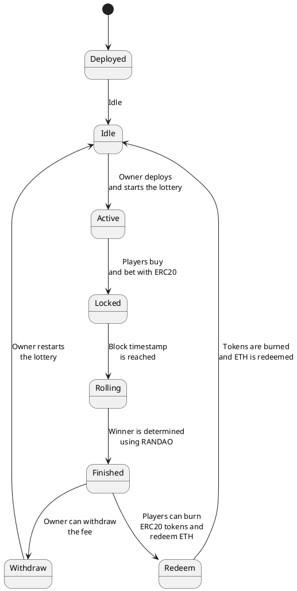

# Lottery contract
> Encode Club BootCamp

* (Review) Design patterns
* Architecture overview
* Lottery structure

### Implementation details

* Implement ownable
* Owner deploy lottery and define betting price and fee
* Owner start lottery
  * Define a block timestamp target
* Players must buy an ERC20 with ETH
* Players pay ERC20 to bet
  * Only possible before block timestamp met
* Anyone can roll the lottery
  * Only after block timestamp target is met
  * Randomness from RANDAO
* Winner receives the pooled ERC20 minus fee
* Owner can withdraw fees and restart lottery
* Players can burn ERC20 tokens and redeem ETH

## State Machine UML

```
+------------------+        +-------------+
|                  |        |             |
|     Deployed     |<-------+    Idle     |
|                  |        |             |
+------------------+        +-------------+
        ^                        |
        |                        |
        |  Owner deploys         | Owner starts
        |  the contract          | the lottery
        |                        v
+------------------+        +-------------+
|                  |        |             |
|     Lottery      +<-------+   Active    |
|                  |        |             |
+------------------+        +-------------+
        ^                        |
        |                        |
        | Players buy and bet    |  Block
        | with ERC20             |  timestamp
        |                        v
+------------------+        +-------------+
|                  |        |             |
|      Bet         |<-------+   Locked    |
|                  |        |             |
+------------------+        +-------------+
        ^                        |
        |                        |
        |                        | Block
        |                        | timestamp
        |                        |
        |                        v
+------------------+        +-------------+
|                  |        |             |
|    Lottery end    |<-------+   Rolling   |
|                  |        |             |
+------------------+        +-------------+
        ^                        |
        |                        |
        |                        | RANDAO
        |                        |
        |                        v
+------------------+        +-------------+
|                  |        |             |
|      Winner      |<-------+   Finished  |
|                  |        |             |
+------------------+        +-------------+
        ^                        |
        |                        |
        |                        | Owner
        |                        | can withdraw
        |                        v
+------------------+        +-------------+
|                  |        |             |
|    Fee Withdraw   |<-------+   Withdraw  |
|                  |        |             |
+------------------+        +-------------+
        ^                        |
        |                        |
        |                        | Players
        |                        | can burn ERC20
        |                        | tokens and
        |                        v
+------------------+        +-------------+
|                  |        |             |
|    ERC20 Redeem   |<-------+   Redeem    |
|                  |        |             |
+------------------+        +-------------+
```



## References

<https://github.com/Encode-Club-Solidity-Bootcamp/Lesson-20>

<https://coinsbench.com/how-to-create-a-lottery-smart-contract-with-solidity-4515ff6f849a>

<https://medium.com/coinmonks/math-in-solidity-part-1-numbers-384c8377f26d>

<https://betterprogramming.pub/learn-solidity-the-factory-pattern-75d11c3e7d29>

<https://blog.logrocket.com/cloning-solidity-smart-contracts-factory-pattern/>

---

## Homework

* Create Github Issues with your questions about this lesson
* Read the references

---

## Weekend Project

* Build a frontend for the Lottery dApp
  * Use any framework of your preference
  * Create a wallet by importing the private key or mnemonic
  * (Bonus) implement metamask wallet connection
